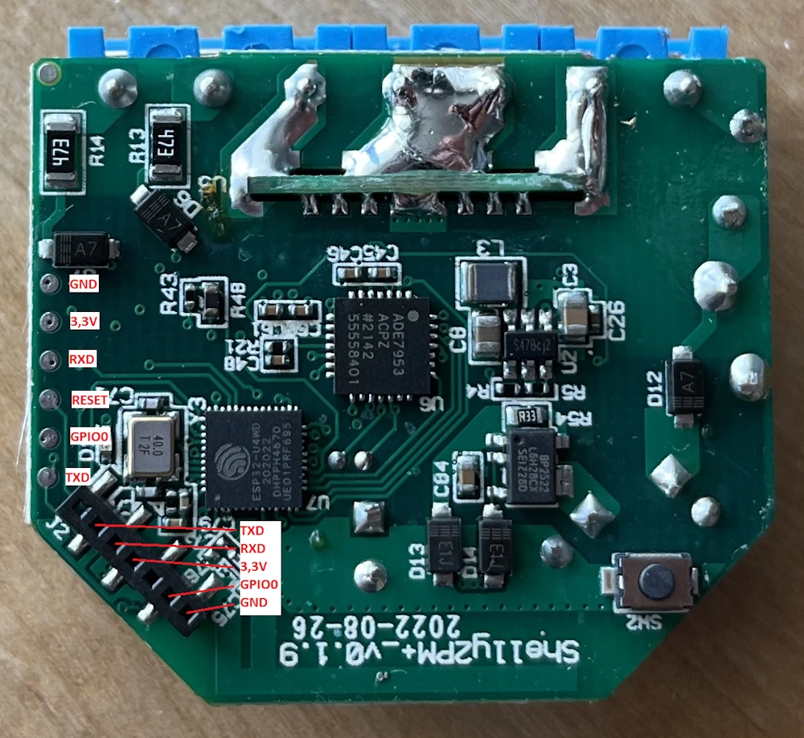

# Shelly 2PM

## Flashing ESPHome

#### Requirements

- 1.27 mm dupont cable or use a needle through normal cable
- USB to UART bridge

#### Install minimal ESPHome

1. Open [web.esphome.io](https://web.esphome.io/)
2. Connect the bridge to the device according to [this](https://templates.blakadder.com/shelly_plus_2PM.html). What worked best for me is to remove the back cover, and use 4 2.54 mm jumper wires, with a 1.27 mm pin soldered to the end.



3. Connect GND to GPIO 0 to put the device into flash mode. For this, I would not use the exposed GPIO pin port, I just simply connected the surface connectors with a 2.54 mm jumper cable.
4. Connect the bridge to the computer
5. Prepare the device for first use

#### Thanks to

- https://templates.blakadder.com/shelly_plus_2PM.html
- https://community.home-assistant.io/t/shelly-plus-1-flashing-and-setup-guide-tutorial/490396

## Thermostat

### Connecting DS18B20 temperature sensors

#### Physical connection

GPIO 0 can also be used as a 1-wire protocol pin, thus DS18B20 can be easily connected. Refer to the [datasheet](https://www.analog.com/media/en/technical-documentation/data-sheets/DS18B20.pdf) for pin layout on the temperature sensor.

#### ESP configuration

1. Set up a [1-wire bus](https://esphome.io/components/one_wire#one-wire)
2. Install the firmware, then copy the address of the sensor from the logs
3. Set up the [Dallas Temperature Sensor](https://esphome.io/components/sensor/dallas_temp.html)
4. Adjust the offset

```yaml
sensors:
  - platform: dallas_temp
    # ...
    filters:
      - offset: 2.0
```
