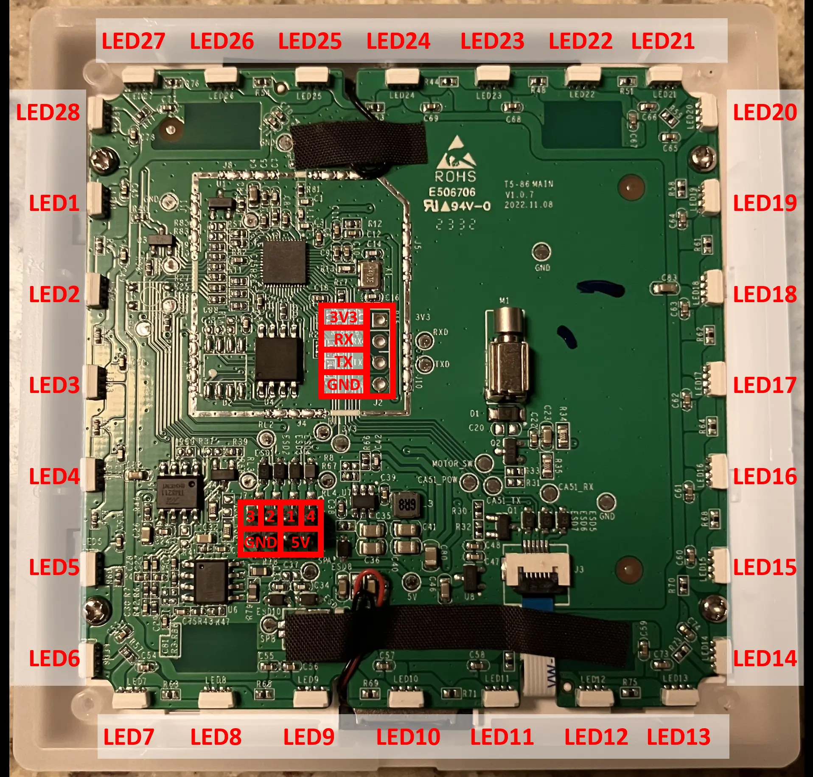
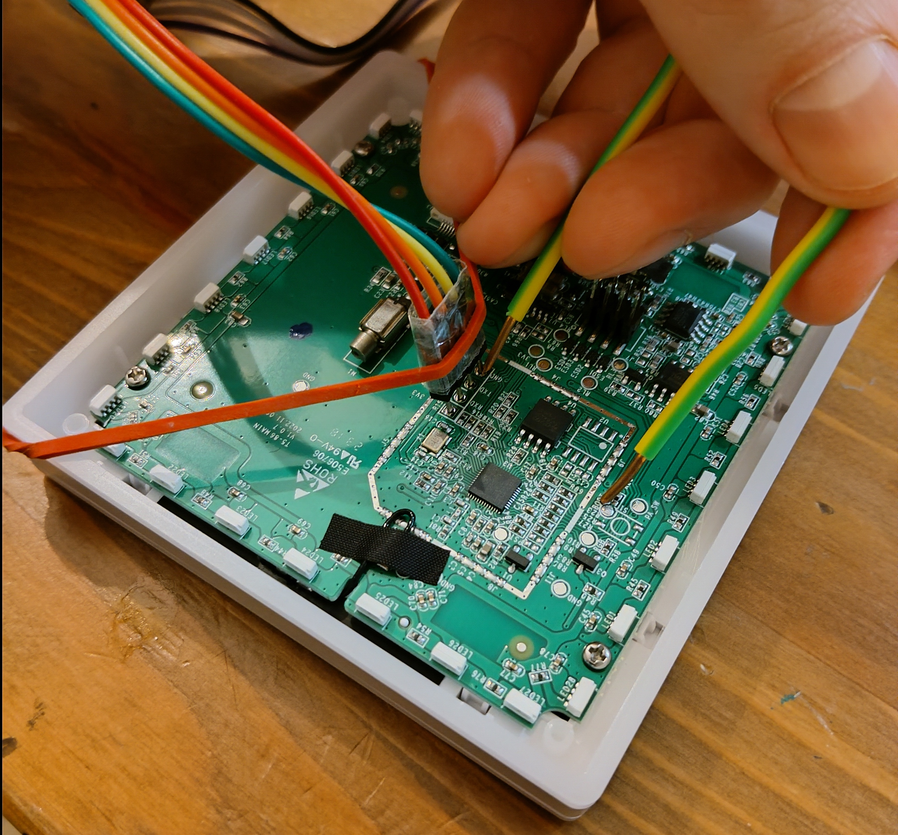

# Sonoff TX Ultimate

## Flashing ESPHome

#### Requirements

- USB to UART bridge

#### Install minimal ESPHome

1. Open [web.esphome.io](https://web.esphome.io/)
2. Connect the bridge to the device according to [this](https://templates.blakadder.com/sonoff_T5-1C-86.html).

3. Connect GND to GPIO 0 to put the device into flash mode. If no LEDs are on, then it is in flash mode.
4. Connect the bridge to the computer
5. Prepare the device for first use

#### Thanks to

- https://templates.blakadder.com/sonoff_T5-1C-86.html
